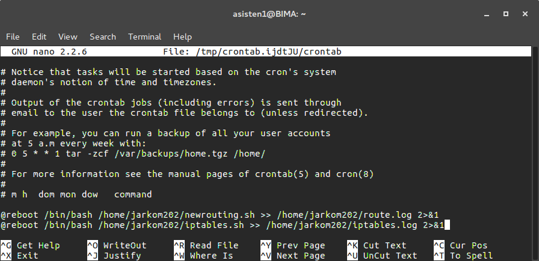

# Sisop Modul 1

## Daftar Isi
1. [Shell Scripting]()
2. [Cron]()
3. [AWK]()
4. [Latihan]()

## 2. Cron
Cron memungkinkan pengguna Linux dan Unix untuk menjalankan perintah atau script pada waktu tertentu secara otomatis. Cron service (daemon) secara konstan memeriksa _/etc/crontab_ file dan _/etc/cron.*/_ direktori juga _/var/spool/cron_ direktori. Setiap user memiliki crontab file masing-masing.

### 2.1 Menambahkan atau mengubah cron job
- Ketikkan `crontab -e`
- Ketikkan syntax crontab sesuai command yang diinginkan
- Untuk melihat entri crontab, jalankan command `crontab -l`
- Syntax crontab:<br>
<br>
- Contoh perintah yang dijalankan dengan cron:<br>
<br>
    1. Menjalankan script routing setiap kali PC dinyalakan dan mencatatnya pada _route.log_
    2. Menjalankan script firewall setiap kali PC dinyalakan dan mencatatnya pada _iptables.log_

### 2.2 Referensi
https://www.cyberciti.biz/faq/how-do-i-add-jobs-to-cron-under-linux-or-unix-oses/

## 3. AWK
`awk` merupakan sebuah program yang bisa digunakan untuk mengambil catatan/record tertentu dalam sebuah file dan melakukan sebuah/beberapa operasi terhadap catatan/record tersebut.
<br>
Fungsi dasar `awk` adalah memeriksa sebuah file per barisnya (atau satuan teks lain) yang mengandung pola tertentu. Ketika sebuah baris cocok dengan salah satu pola, `awk` akan melakukan action tertentu pada baris tersebut. `awk` melanjutkan proses sampai menemui _end of file_ pada file yang menjadi masukan tadi.
<br>
__FYI__: `awk` versi baru dinamakan `gawk`, tapi biasanya tetap disebut `awk`.

### 3.1 Menjalankan program awk
__Syntax__:
```shell
awk options 'selection _criteria {action }' input-file > output-file
```

Misalkan kita memiliki data mahasiswa sebagai berikut:
```
hafara sidoarjo 1998 2015
satria bali 1996 2015
raldo cepu 1998 2016
awan sidoarjo 1996 2015
khawari semarang 1998 2016
aguel semarang 1998 2016
didin mojokerto 1997 2015
tamtam rembang 1997 2016
```

1. Secara default `awk` akan print semua baris pada file masukan:
```shell
awk '{print}' mahasiswa.txt
```

2. Print baris yang mengandung pola yang dimasukkan:
```shell
awk '/sidoarjo/ {print}' mahasiswa.txt
```

Maka hasilnya adalah sebagai berikut:
```
hafara sidoarjo 1998 2015
awan sidoarjo 1996 2015
```

3. Dalam setiap baris, `awk` akan membagi setiap kata yang dipisahkan oleh spasi dan menyimpannya pada variabel `$n`. Jika terdapat 4 kata pada satu baris, maka kata pertama akan disimpan pada variabel `$1`, kata kedua pada variabel `$2`, dan seterusnya. `$0` merepresentasikan semua kata yang ada pada satu baris.
```shell
awk '/semarang/ {print $1,$2}' mahasiswa.txt
```

Maka hasilnya adalah sebagai berikut:
```
khawari semarang
aguel semarang
```

__Catatan__:
Dalam rule program `awk` boleh menghilangkan hanya salah satu di antara action atau pola. Jika pola dihilangkan, maka action akan diberlakukan ke semua baris. Sedangkan jika action dihilangkan, maka setiap baris yang mengandung pola tersebut akan secara default ditampilkan secara penuh.

### 3.2 Special Rules
Program `awk` memiliki rule yang memiliki kelakuan khusus. Di antaranya adalah `BEGIN` dan `END`. Rule `BEGIN` hanya dieksekusi satu kali, yaitu sebelum input dibaca. Rule `END` pun juga dieksekusi satu kali, hanya setelah semua input selesai dibaca. Contoh:
```shell
awk '
BEGIN { print "Jumlah baris yang terdapat \"2015\"" }
/2015/  { ++n }
END   { print "\"2015\" muncul", n, "kali." }' mahasiswa.txt
```

Maka hasilnya adalah sebagai berikut:
```
Jumlah baris yang terdapat "2015"
"2015" muncul 4 kali.
```

Pada contoh di atas, rule kedua hanya memiliki action untuk melakukan perhitungan berapa jumlah baris yang mengandung "2015", namun tidak ada action untuk menampilkan (print).


### 3.3 Referensi
1. https://www.gnu.org/software/gawk/manual/gawk.html
2. https://www.geeksforgeeks.org/awk-command-unixlinux-examples/